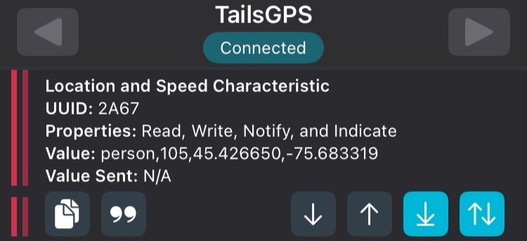

# T.A.I.L.S. — Base Station (Ground Node)

By Frederick Andrews, Jad Mghabghab, Josué Dazogbo, Maureen Kouassi, Mouad Ben lahbib, Computer Engineering Students at the University of Ottawa  
Date: 5 October 2025  

## Overview  

The **Base Station** (Ground Node) is the communication hub of the **T.A.I.L.S. (Tactical Aerial Insight and Localization Suite)** system. It is built around the **Heltec WiFi LoRa 32 (V3)** board, leveraging its dual **LoRa** and **BLE** capabilities to bridge long-range drone telemetry with nearby mobile devices.  

The station receives data packets sent by the onboard drone module via **LoRa SX1262 radio**, processes the data, and rebroadcasts it over **BLE** to the mobile application since most telephones do not natively support the LoRa communication protocol. This allows real-time drone telemetry, GPS coordinates, and AI-detected Points of Interest (POIs) to be visualized on the app.  

<!-- Add picture of the ground node here -->

## Features  

- 📡 **LoRa Reception**: Captures telemetry and AI inference data transmitted from the onboard node.  
- 🔄 **LoRa-to-BLE Bridge**: Converts LoRa packets into BLE packets for seamless communication with mobile devices.  
- 🛠️ **Debug Console**: Serial monitor output for packet verification and troubleshooting.   

## Hardware  

- **Heltec WiFi LoRa 32 (V3)** (ESP32 + LoRa SX1262)  
- **LoRa Antenna** for extended range communication  
- **BLE-enabled Mobile Device** (for testing and final integration with TAILS app)  

## Software  

The Base Station firmware is written in **C++**. Key libraries include:  

- `LoRa.h` — Handles LoRa radio communication with the drone  
- `BLEDevice.h` — Manages BLE advertisement and GATT services for mobile app connectivity  
- `TinyGPSPlus.h` — Decodes NMEA GPS sentences transmitted from the drone  

### Message Flow  

1. **Drone → LoRa TX**: Drone sends packets containing telemetry (GPS, altitude, POIs).  
2. **Base Station → LoRa RX**: Heltec LoRa board receives the packet.  
3. **Packet Parsing**: Extracts GPS, object detection, and metadata.  
4. **BLE Broadcasting**: Data is relayed to the mobile application for real-time visualization.

  
  
<em>Figure: BLE terminal output showing received telemetry and POI (human detected at specific coordinates)</em>

## Software Architecture

The `src/` directory contains the following modules:

- **`HeltecLoRaApp.ino`**  
  Main firmware file. Initializes hardware, sets up LoRa and BLE interfaces, and runs the main event loop to process incoming telemetry and forward it to mobile devices.

- **`LoRaInterface.cpp` / `LoRaInterface.h`**  
  Manages the SX1262 LoRa transceiver. Handles configuration, packet reception from the drone, and triggers data processing routines.

- **`BLEInterface.cpp` / `BLEInterface.h`**  
  Implements Bluetooth Low Energy (BLE) services and characteristics. Packages telemetry data for BLE transmission, manages device connections, and handles advertising to mobile clients.

This modular structure allows the Base Station to reliably receive drone telemetry via LoRa, parse and format the data, and broadcast it over BLE for visualization in the mobile app.

